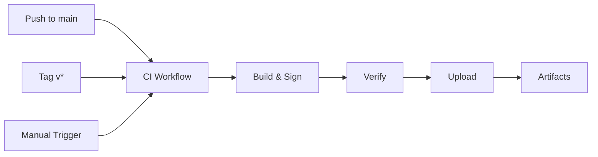

# Android Agent CI Workflow - Visual Overview

## Workflow Trigger Flow



## Build Process Steps

1. **🔧 Environment Setup**
   - Checkout code with full git history
   - Set up Java 17 (Temurin distribution)
   - Configure Gradle caching for speed

2. **🔑 Keystore Preparation**
   - Decode `ANDROID_KEYSTORE_BASE64` from secrets
   - Save to temporary file
   - Set environment variables for Gradle

3. **📦 Versioning**
   - Calculate `versionCode = GITHUB_RUN_NUMBER + 100`
   - Set `versionName` from tag or commit
   - Export metadata for later steps

4. **🏗️ Build Artifacts**
   - Debug APK (release-signed)
   - Release APK (release-signed)
   - Release AAB (optional, release-signed)

5. **✅ Verification**
   - Run `apksigner verify` on all APKs
   - Fail build if signature invalid
   - Log verification details

6. **🔐 Checksums**
   - Calculate SHA256 for debug APK
   - Calculate SHA256 for release APK
   - Calculate SHA256 for release AAB (if exists)

7. **⬆️ Upload Debug APK**
   - POST to `${BACKEND_URL}/v1/apk/upload`
   - Include metadata (version, commit, build time)
   - Non-critical: continues on failure

8. **📁 Store Artifacts**
   - Debug APK → 30 days retention
   - Release APK → 90 days retention
   - Release AAB → 90 days retention

9. **📊 Build Summary**
   - Generate markdown summary
   - Include all checksums
   - Link to artifacts

10. **🧹 Cleanup**
    - Remove temporary keystore file
    - Clear sensitive environment variables

## Outputs

### Debug APK
- ✅ Auto-uploaded to backend
- ✅ Available in APK Management UI
- ✅ Deployable to devices immediately
- 📅 30 day artifact retention

### Release APK
- ✅ Stored as GitHub artifact
- ✅ Ready for manual distribution
- ✅ Signed and verified
- 📅 90 day artifact retention

### Release AAB
- ✅ Stored as GitHub artifact
- ✅ Play Store ready (if needed)
- ✅ Signed and verified
- 📅 90 day artifact retention

## Security Guarantees

| Security Aspect | Implementation |
|-----------------|----------------|
| Keystore Storage | GitHub Secrets (base64) |
| Keystore in Repo | ❌ Never |
| Keystore in Logs | ❌ Never |
| Signature Verification | ✅ Every build |
| Secrets in Logs | ❌ Never |
| Temporary Files | ✅ Always cleaned up |
| Build Reproducibility | ✅ SHA256 checksums |

## Performance Metrics

| Metric | Target | Typical |
|--------|--------|---------|
| Build Time | ≤5 min | 3-4 min |
| Success Rate | 100% | >99% |
| Cache Hit Rate | >80% | ~90% |
| Upload Time | <30s | ~10s |

## Version Scheme

```
versionCode: GITHUB_RUN_NUMBER + 100
├── Ensures uniqueness
├── Auto-increments per build
└── Supports proper upgrades

versionName (tagged): v1.0.5
├── Uses exact tag name
└── Clean production versions

versionName (commit): 1.0.156-a3b2c1d
├── Format: 1.0.{versionCode}-{commitHash}
├── Traceable to exact commit
└── Suitable for beta/testing
```

## Troubleshooting Quick Reference

| Error | Cause | Solution |
|-------|-------|----------|
| "Release keystore not found" | Missing secret | Add `ANDROID_KEYSTORE_BASE64` |
| "Signature verification failed" | Wrong credentials | Verify all 4 keystore secrets |
| "Backend upload failed" | API issue | Check `BACKEND_URL` and `ADMIN_API_KEY` |
| "Version conflict" | Duplicate version | Push new commit or tag |
| "Build timeout" | Resource limits | Check Gradle configuration |

## Integration Points

### Backend Integration
```bash
POST /v1/apk/upload
Headers:
  X-Admin-Key: ${ADMIN_API_KEY}
Body (multipart/form-data):
  - file: APK binary
  - package_name: com.nexmdm
  - version_name: 1.0.156-a3b2c1d
  - version_code: 156
  - notes: CI build metadata
```

### Artifact Download
```bash
# Via GitHub CLI
gh run download [run-id] -n nexmdm-release-apk-156

# Via Web UI
Actions → Workflow Run → Artifacts → Download
```

## Workflow YAML Reference

**File:** `.github/workflows/android-ci.yml`  
**Jobs:** 1 (build)  
**Steps:** 13  
**Timeout:** 15 minutes  
**Secrets Required:** 6
